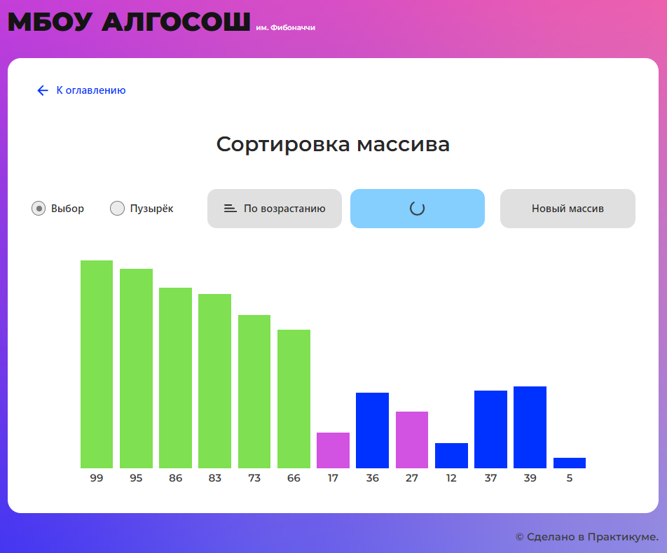

# 📊 Визуализатор алгоритмов «МБОУ АЛГОСОШ им. Фибоначчи». 📎Не залипни на сортировку! 📊 🌞

Проект "МБОУ АЛГОСОШ им. Фибоначчи" представляет собой одностраничное веб-приложение реализованное в рамках обучения.
Задача проекта - создание инструмента для визуализации различных алгоритмов и структур данных с целью более глубокого
понимания их работы. Приложение позволяет пользователям интерактивно изучать и наблюдать процесс работы алгоритмов,
таких как разворот строки, генерация последовательности Фибоначчи, сортировка массива. Оно также обеспечивает
возможность визуального отображения добавления и удаления элементов в структурах данных, таких как стек, очередь и
связный список.

### Ссылки
[Готовый проект на gh-pages](https://gudrum1983.github.io/algososh) 
| [Макет в Figma](https://www.figma.com/file/RIkypcTQN5d37g7RRTFid0/Algososh_external_link?node-id=0%3A1) 
| [Техническое задание](https://github.com/yandex-praktikum/algososh)



## Что сделала
- Создала интерактивное веб-приложение для визуализации алгоритмов с пошаговым отображением.
- Реализовала юнит-тестирование: снимки отдельных компонентов button и circle а так же алгоритма разворота строки и 
  сортировки выбором и пузырьком.
- Реализовала E2E тестирование: проверка работоспособности приложения, проверка переходов по страницам, 
  функциональности отдельных компонентов, страниц и корректность отображения и взаимодействия с элементами интерфейса.


👍- Реализовала паттерн проектирования 📷 «Снимок» ✅ ([memento.ts](src/utils/memento.ts)) для повышения переиспользуемости 
кода в случаях с простыми структурами данных и алгоритмами. [](https://refactoring.guru/ru/design-patterns/memento)

👍- Изучила и внедрила [лучшие практики Cypress](https://docs.cypress.io/guides/references/best-practices) 
1. Использовала [выбор элементов](https://docs.cypress.io/guides/references/best-practices#Selecting-Elements) - для идентификации 
   тестируемых элементов использовала атрибут 🔎`data-cy`✅ что улучшило стабильность и читаемость тестов. 
[Пример](https://github.com/gudrum1983/algososh/blob/dfd3a667d0f4f0d93ef331776c677a127ab2f751/src/components/fibonacci-algorithm-viewer/fibonacci-algorithm-viewer.tsx#L56)
2. Исключила  ⏳`cy.wait` ❌ [ненужные ожидания](https://docs.cypress.io/guides/references/best-practices#Unnecessary-Waiting) в тестах,
   даже при наличии анимации, зависящей от таймаутов.  [Пример](https://github.com/gudrum1983/algososh/blob/9bbd27276c5be10694fe8296802bf74507b46341/cypress/e2e/queue.cy.ts#L88)
3. Создала ️🪄[кастомные команды для Cypress](https://docs.cypress.io/api/cypress-api/custom-commands) пример в
[commands.ts](https://github.com/gudrum1983/algososh/blob/9bbd27276c5be10694fe8296802bf74507b46341/cypress/support/commands.ts)
	- `getDataCy` и `getAlias`: Получение элементов по атрибуту `data-cy` и псевдониму.
	- Проверка состояния кнопок и fieldset: `checkDisabledButtonsWithEmptyInput`, `checkDisabledFieldsetAfterClickButton`,
      `checkActivityButtonsWithNonEmptyInput`: 


___

### Используемые инструменты и технологии

- Языки: `HTML` `CSS` `TypeScript`
- Фреймворки и инструменты для тестирования: `Cypress` `Jest`  `React Testing Library`
- Инструменты управления проектом: `Git` `GitHub` `GitHub Pages`
- Инструменты для разработки и сборки проекта: `Node.js` `Webpack` `Yarn` `Create React App` `React Router`

---

## Установка и запуск

Для запуска проекта локально выполните следующие шаги:

1. Клонируйте репозиторий:
    ```bash
    git clone https://github.com/gudrum1983/algososh.git
    ```

2. Перейдите в директорию проекта:
    ```bash
    cd algososh
    ```

3. Установите зависимости:
    ```bash
    yarn install
    ```

4. Запустите проект:
    ```bash
    yarn start
    ```

5. Откройте [http://localhost:3000](http://localhost:3000) для просмотра в браузере.

## Тестирование

Для запуска тестов используйте команду:
```bash
yarn test
```

## Системные требования
Для работы с проектом потребуется Node.js и любой современный браузер.

----------
###### Кочкина Екатерина - Спринты 11 - 12: Алгоритмы, структуры данных, тестирование, ФП и др.


